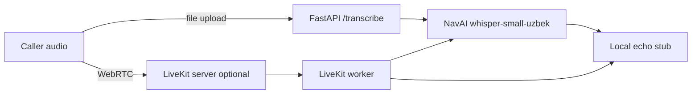

# Uzbek voice agent

Personal portfolio demo of Uzbek speech-to-text. A caller can upload a clip to a small HTTP API, or join a [LiveKit](https://github.com/livekit/livekit) room where a worker transcribes with [NavAI Whisper-small Uzbek](https://huggingface.co/navai-uz/whisper-small-uzbek). Nothing here is a bank system, a call-center product, or an employment claim.

The HTTP path is the one you can run with no LiveKit account. Realtime audio needs a LiveKit server. Compose starts one locally; LiveKit Cloud is optional.

## What a recruiter can try

1. `POST /transcribe` with a wav, flac, or ogg file. The JSON has the transcript and an echo line so you can see the turn shape without an LLM key.
2. `GET /health` for process status. It does not download the model.
3. `make eval-asr` for word and character error on a stated prefix of a public Uzbek test set. The command refuses every split except `test` and does not train.

## Architecture



The worker follows the session shape of [agent-starter-python](https://github.com/livekit-examples/agent-starter-python): `AgentServer`, an `rtc_session` entrypoint, `AgentSession`, then `ctx.connect()`. Speech-to-text is the local NavAI model. The LLM slot is an in-process echo (`Siz aytdingiz: ...`). TTS is unset, so the room gets the agent text path and does not synthesize speech.

## Run the file API

CPU is the default. A GPU is optional: install a CUDA PyTorch build and set `ASR_DEVICE=cuda`.

```bash
python -m venv .venv
source .venv/bin/activate
pip install torch --index-url https://download.pytorch.org/whl/cpu
pip install -e ".[asr,dev]"
uvicorn uzbek_voice_agent.api:app --host 0.0.0.0 --port 8000
```

Open `http://localhost:8000` and upload a clip, or:

```bash
curl -s -F "file=@tests/fixtures/tone.wav" http://localhost:8000/transcribe
curl -s http://localhost:8000/health
```

The first transcription downloads `navai-uz/whisper-small-uzbek` from Hugging Face (about 1 GB of weights).

### Docker Compose

```bash
docker compose up --build api
```

That publishes the API on port 8000 and caches weights in a volume. It does not start LiveKit.

## LiveKit

Local server, no Cloud account:

```bash
docker compose --profile realtime up --build
```

That starts `livekit-server` with the demo key pair in `deploy/livekit.yaml` (`devkey` / `secret`), plus the agent worker. Those credentials are for a machine you control. Change them before any public port forward.

Mint a join token from the API once the `agent` extra is installed:

```bash
curl -s -X POST "http://localhost:8000/livekit/token?room=uzbek-demo&identity=guest"
```

Point a LiveKit client at `ws://localhost:7880` with that token. The worker loads the same Whisper model on CPU, so the first utterance is slow.

Without Docker, the same worker is:

```bash
export LIVEKIT_URL=ws://localhost:7880
export LIVEKIT_API_KEY=devkey
export LIVEKIT_API_SECRET=secret
python -m uzbek_voice_agent.agent dev
```

LiveKit Cloud is optional. Set `LIVEKIT_URL`, `LIVEKIT_API_KEY`, and `LIVEKIT_API_SECRET` from the Cloud project and run the worker the same way. Do not commit those values.

## Eval

```bash
make eval-asr LIMIT=8
```

| Item | Value |
| --- | --- |
| Model | `navai-uz/whisper-small-uzbek` |
| Set | `google/fleurs`, config `uz_uz`, split `test` |
| Slice | first 8 rows in Hugging Face streaming order |
| Training | not run; the test split is not used to fit weights |
| Numbers | filled from `eval/fleurs_uz_prefix.json` after a local run |

NavAI's own card reports **16.96 WER** on the full FLEURS Uzbek test set, **9.58 WER** on Common Voice 22 Uzbek test, and **11.57 macro WER** across FLEURS, Common Voice, USC, and FeruzaSpeech. Those figures are theirs, scored with `uzbek_text_norm` on the full sets. A prefix of FLEURS measured here will not match them.

## Tests

CI installs `.[dev]` only. It lints with Ruff and runs pytest against `tests/fixtures/tone.wav`. It does not download Hugging Face weights.

```bash
pip install -e ".[dev]"
make ci
```

## Limits

- Whisper-small on CPU is the supported default. It is not a realtime call-center stack.
- The echo reply does not answer questions. There is no paid LLM in the core demo.
- TTS is not wired, so the LiveKit worker does not speak audio back.
- Telephony and SIP are out of scope.
- This repo does not fine-tune Whisper.
- Subset WER/CER is not the NavAI leaderboard number.
- Far-field noise, strong dialect, and rare names are weak spots called out on the model card.
- Demo LiveKit keys in `deploy/livekit.yaml` are not a production secret.

## Credits and licenses

| Piece | License |
| --- | --- |
| This repository's code | MIT, see `LICENSE` |
| [livekit-examples/agent-starter-python](https://github.com/livekit-examples/agent-starter-python) | MIT, Copyright (c) 2025 LiveKit, Inc. |
| [livekit/agents](https://github.com/livekit/agents) | Apache-2.0 |
| [navai-uz/whisper-small-uzbek](https://huggingface.co/navai-uz/whisper-small-uzbek) | Apache-2.0 weights |
| `google/fleurs` `uz_uz` test audio, used only at eval time | CC-BY-4.0 |

Details are in `NOTICE`.
